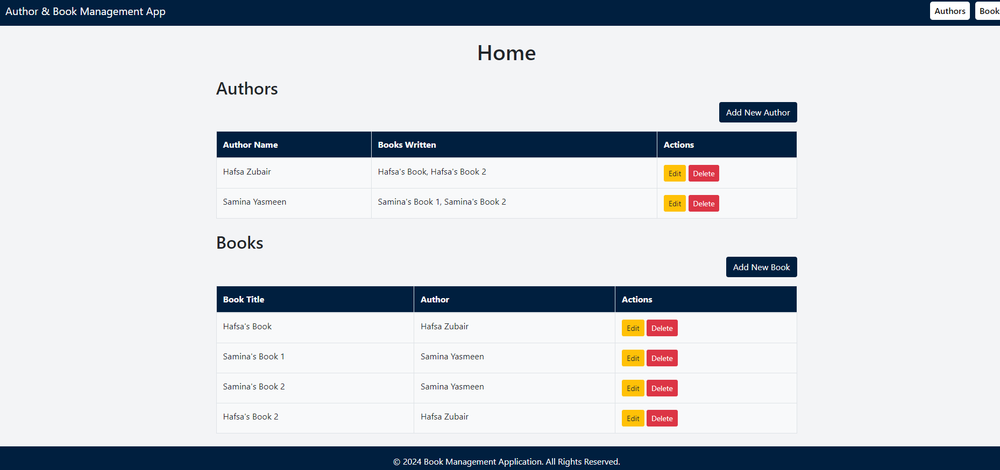
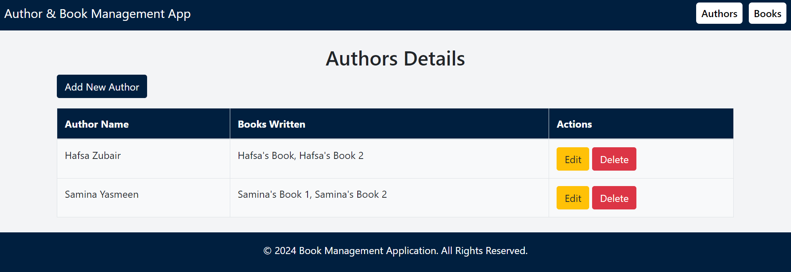
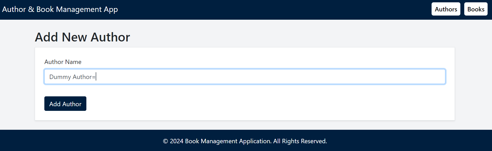
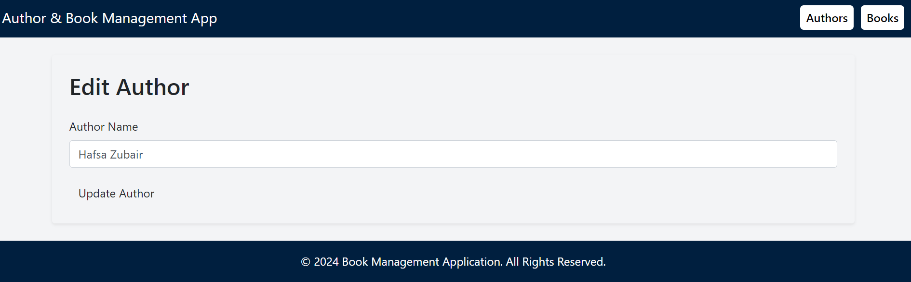
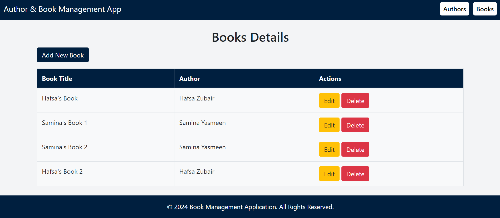
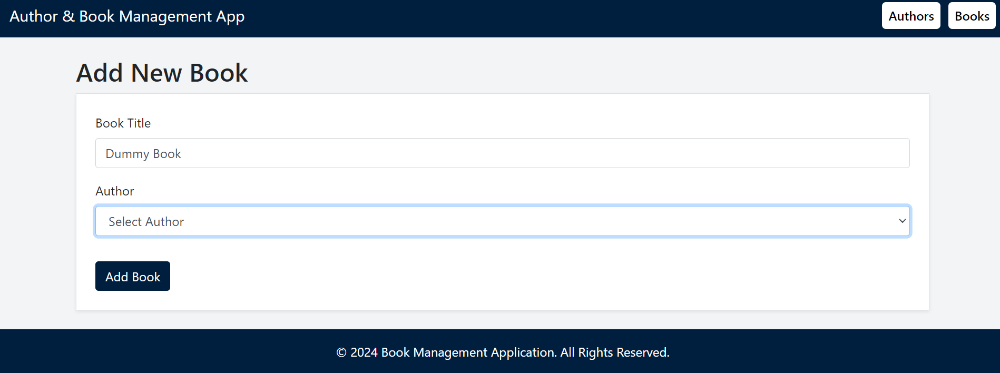
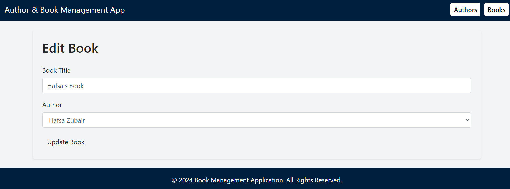

# AuthorBookApp

## Project Overview

**AuthorBookApp** is a Laravel-based web application designed to manage authors and their books. It provides an intuitive interface to view, add, edit, and delete authors and books. 

### Home Page

Upon accessing the application, you land on the Home Page. This page serves as the central hub, offering quick access to two main sections: **Authors Management** and **Books Management**.

### Authors Management

On the Authors Index Page, you can see a list of all authors. Each entry displays the author's name and a list of books they have written. The page also provides options to edit or delete authors.

- **Add a New Author**: Click the "Add New Author" button, enter the author's name, and submit the form.
- **Edit an Existing Author**: Click the "Edit" button next to the author’s name, update the details, and save the changes.
- **Delete an Author**: Click the "Delete" button next to the author’s name and confirm the deletion.

### Books Management

On the Books Index Page, you can see a list of all books. Each entry displays the book title and the author who wrote it. The page also provides options to edit or delete books.

- **Add a New Book**: Click the "Add New Book" button, enter the book details, select the author from the dropdown list, and submit the form.
- **Edit an Existing Book**: Click the "Edit" button next to the book title, update the details, and save the changes.
- **Delete a Book**: Click the "Delete" button next to the book title and confirm the deletion.

### Screenshots

*The central hub of the application.*

*View, add, edit, or delete authors.*

*Add new author*

*edit any author details*

*View, add, edit, or delete books.*

*Add new book*

*edit any book details*
